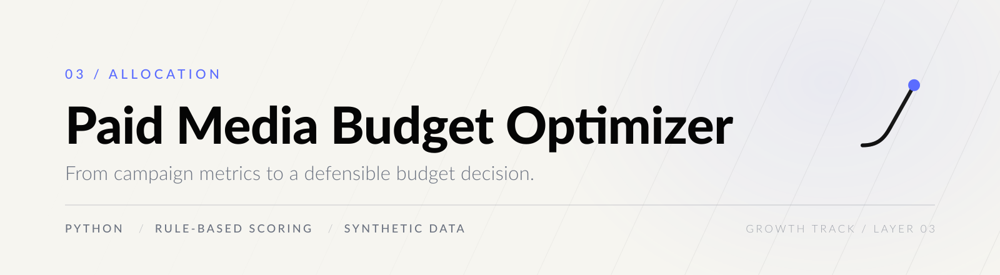
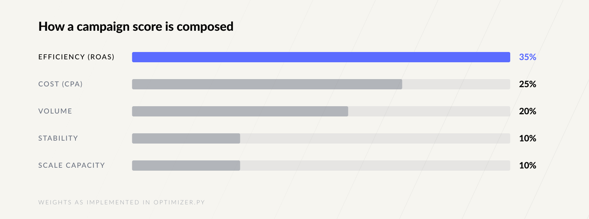

<p align="center">
  <picture>
    <source media="(prefers-color-scheme: dark)" srcset="assets/brand/header-dark.svg">
    
  </picture>
</p>

<p align="center">
  
  
  
  
</p>

**A budget split should survive being questioned.** This optimizer scores campaigns from explicit,
readable signals and redistributes a fixed budget — so the allocation can be argued with, not just
accepted.

---

## 01 — The decision this supports

Given a fixed budget and a set of campaigns, decide where each marginal unit goes, and be able to
state *why* in one sentence per campaign.

The model is deliberately transparent rather than optimal. A split that nobody can interrogate does
not get implemented.

---

## 02 — How a score is composed

<p align="center">
  <picture>
    <source media="(prefers-color-scheme: dark)" srcset="assets/brand/weights-dark.svg">
    
  </picture>
</p>

| Signal | Weight | Implementation |
| --- | --- | --- |
| **Efficiency** | 35% | `min(roas / 4, 1)` — return, capped so one outlier cannot dominate. |
| **Cost** | 25% | `1 / (1 + cpa / 100)` — a decay curve, not a cliff. |
| **Volume** | 20% | `min(conversions / 50, 1)` — evidence that the signal is real. |
| **Stability** | 10% | Supplied directly; protects against rewarding noise. |
| **Scale capacity** | 10% | Supplied directly; headroom to absorb more budget. |

Budget is then distributed in proportion to score, with a floor of `0.01` so no campaign is zeroed
out by rounding.

---

## 03 — Score and decision are separate

A high score earns budget. It does not automatically earn *more* budget.

```python
if score >= 0.7 and scale_capacity >= 0.6:  return "prioritize"
if score >= 0.45:                           return "observe"
return "reduce"
```

Running the bundled example makes the distinction visible:

```bash
python src/paid_media_budget_optimizer/optimizer.py data/sample_campaigns.csv --budget 10000
```

| Campaign | Score | Recommended | Change | Decision |
| --- | --- | --- | --- | --- |
| Search — Brand | 0.9013 | 2,773.66 | +38.7% | `observe` |
| Retargeting | 0.8719 | 2,683.18 | +78.9% | `observe` |
| Search — Non Brand | 0.8090 | 2,489.61 | −28.9% | `prioritize` |
| Meta — Prospecting | 0.6673 | 2,053.55 | −31.6% | `observe` |

The highest-scoring campaign is *not* the one marked `prioritize`. Brand search performs well but has
a scale capacity of `0.45` — demand is capped, so extra budget would buy impressions it cannot
convert. Non-brand search scores lower and still carries the `prioritize` label because it has the
headroom to absorb spend. **Efficiency ranks campaigns; headroom decides where growth comes from.**

---

## 04 — Run

```bash
python src/paid_media_budget_optimizer/optimizer.py data/sample_campaigns.csv --budget 10000
python -m pytest
```

Input columns: `campaign, spend, conversions, cpa, roas, stability, scale_capacity`.

---

## 05 — Limitations

- This is a **rule-based prototype**, not a statistical attribution model and not a media mix model.
  Weights are judgement, made explicit so they can be challenged and changed.
- `stability` and `scale_capacity` are **supplied inputs**, not inferred. The quality of the output
  depends on how honestly they are set.
- The audited repositories contained a Google keyword generator and roadmap references to Meta Ads,
  Google Ads, CAC and conversion tracking, but **no mature budget optimizer**. This repository is a
  minimal prototype with synthetic data.
- Proportional allocation assumes return scales smoothly with spend. Real auctions saturate.

---

## Growth track

<p align="center">
  <picture>
    <source media="(prefers-color-scheme: dark)" srcset="assets/brand/chain-dark.svg">
    
  </picture>
</p>

<p align="center">
  <a href="https://github.com/arielabade/marketing-analytics-portfolio">Previous layer: Marketing Analytics Portfolio</a>
  &nbsp;·&nbsp;
  <a href="https://github.com/arielabade">Portfolio overview</a>
</p>
